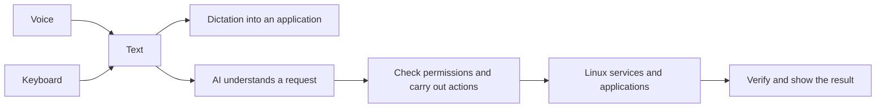

# VPLinuxAI — start here

This is the map of the project and its documentation. **Read this page first; the detailed documents are references, not a required reading list.**

**This file:** `/home/mike/git/voicePlusLinux/docs/High-Level-Design/README.md`

## Where each architectural area belongs

| Folder | Purpose |
| --- | --- |
| `/home/mike/git/voicePlusLinux/docs/High-Level-Design/` | Vision, overall plan and architecture, shared requirements and choices, project-wide evaluation, progress, and backlog. |
| `/home/mike/git/voicePlusLinux/docs/V2T-Design/` | Microphone capture, transcription, transcript handling, V2T reuse, and distant voice pickup. |
| `/home/mike/git/voicePlusLinux/docs/AI-Design/` | AI interpretation, model evaluation and context supplied to AI. Conversation continuity is a critical cross-area responsibility currently described in the overall architecture. |
| `/home/mike/git/voicePlusLinux/docs/OS-Integration-Design/` | Linux and desktop integration, permissions, action execution, interfaces, configuration, recovery, and packaging. |

Each document has one primary home. Shared topics use links rather than duplicate documents. These folders contain requirements, questions, proposals, and evidence; placement does not mean a proposal has been approved. Project-wide evaluation and component comparisons remain together because they span both voice and AI.

VPLinuxAI will be an open-source Linux OS where you can speak or type ordinary English, dictate text, and ask AI to carry out system actions. V2T sets the minimum voice-input standard. The finished system must work independently of Codex or any required proprietary service.

## How the system fits together

This is the proposed main flow. AI could also help with transcription. Linux provides the foundation; voice and AI become part of using it. Simple controls let the user correct or cancel a request. Command lines and configuration files remain available.

## The three main documents

| Read | What it answers |
| --- | --- |
| Vision-high-level description — [/home/mike/git/voicePlusLinux/docs/High-Level-Design/vision-high-level-description.md](vision-high-level-description.md) | **What does Mike want to build, and why?** |
| VP Linux AI-high-level implementation plan — [/home/mike/git/voicePlusLinux/docs/High-Level-Design/VP-Linux-AI-high-level-implementation-plan.md](VP-Linux-AI-high-level-implementation-plan.md) | **What are the major steps to get there?** Includes the language discussion. |
| **This project map** | **How do the parts and supporting documents fit together?** |

Those three are enough for a high-level understanding. The documents below expand particular parts of the plan.

## The supporting chapters, in order

| Part of the project | Main chapter | Open it when you want to understand… |
| --- | --- | --- |
| 1. The foundation | [/home/mike/git/voicePlusLinux/docs/OS-Integration-Design/linux-platform.md](../OS-Integration-Design/linux-platform.md) | What existing Linux system we build on and what “completely open source” requires. |
| 2. The construction choices | [/home/mike/git/voicePlusLinux/docs/High-Level-Design/languages.md](languages.md) and [/home/mike/git/voicePlusLinux/docs/High-Level-Design/architecture.md](architecture.md) | What we write, possible languages, and how the components communicate. |
| 3. Voice becomes text | [/home/mike/git/voicePlusLinux/docs/V2T-Design/voice-input.md](../V2T-Design/voice-input.md) | V2T reuse, transcription, dictation, and correction. The [/home/mike/git/voicePlusLinux/docs/V2T-Design/v2t-source-review.md](../V2T-Design/v2t-source-review.md) supplies source evidence. |
| 4. Text becomes an action | [/home/mike/git/voicePlusLinux/docs/AI-Design/ai-interpretation.md](../AI-Design/ai-interpretation.md) → [/home/mike/git/voicePlusLinux/docs/OS-Integration-Design/actions-and-recovery.md](../OS-Integration-Design/actions-and-recovery.md) | How English becomes a proposed action, how it gets checked, and how we establish what actually happened. |
| 5. The everyday experience | [/home/mike/git/voicePlusLinux/docs/OS-Integration-Design/desktop-and-accessibility.md](../OS-Integration-Design/desktop-and-accessibility.md) | How a person activates, uses, corrects, and cancels the system. |
| 6. A usable OS release | [/home/mike/git/voicePlusLinux/docs/High-Level-Design/evaluation.md](evaluation.md) → [/home/mike/git/voicePlusLinux/docs/OS-Integration-Design/packaging-and-release.md](../OS-Integration-Design/packaging-and-release.md) | How we prove it works at least as well as V2T, then build and distribute it. |

## Where we actually are

**We have a design and small disposable prototypes—not an operating system yet.** Typed requests, corrections, cancellation, and simple folder creation/search work in temporary test files. Synthetic transcript events test the voice-to-text boundary. An inference connection exists, but no real model has been evaluated and no microphone is connected.

The next useful demonstration is one complete voice → text → real open-source AI → verified Linux action workflow. Choosing the final Linux base, models, and production languages remains open. Prototype Python code does not settle those choices.

Use [/home/mike/git/voicePlusLinux/docs/High-Level-Design/progress.md](progress.md) for evidence of what works, [/home/mike/git/voicePlusLinux/docs/High-Level-Design/decisions.md](decisions.md) for what is settled versus proposed, and [/home/mike/git/voicePlusLinux/docs/High-Level-Design/implementation-backlog.md](implementation-backlog.md) for the work sequence.

## Technical appendices — skip these until implementing that part

These existing documents explain details within the chapters above. They are **not additional projects or additional phases**.

| Belongs to | Supporting detail |
| --- | --- |
| Overall design | [/home/mike/git/voicePlusLinux/docs/High-Level-Design/requirements.md](requirements.md), [/home/mike/git/voicePlusLinux/docs/High-Level-Design/workflow-scenarios.md](workflow-scenarios.md), [/home/mike/git/voicePlusLinux/docs/High-Level-Design/component-candidates.md](component-candidates.md) |
| Voice input | [/home/mike/git/voicePlusLinux/docs/V2T-Design/transcript-boundary.md](../V2T-Design/transcript-boundary.md) |
| Voice capture — open issue | [/home/mike/git/voicePlusLinux/docs/V2T-Design/far-field-voice-capture-10-to-15-feet.md](../V2T-Design/far-field-voice-capture-10-to-15-feet.md) — microphone options, noise reduction, and the proposed distance evaluation. |
| AI and actions | [/home/mike/git/voicePlusLinux/docs/OS-Integration-Design/contracts.md](../OS-Integration-Design/contracts.md), [/home/mike/git/voicePlusLinux/docs/OS-Integration-Design/lifecycle.md](../OS-Integration-Design/lifecycle.md), [/home/mike/git/voicePlusLinux/docs/OS-Integration-Design/protocol-and-errors.md](../OS-Integration-Design/protocol-and-errors.md), [/home/mike/git/voicePlusLinux/docs/OS-Integration-Design/recovery-cases.md](../OS-Integration-Design/recovery-cases.md) |
| OS integration | [/home/mike/git/voicePlusLinux/docs/OS-Integration-Design/configuration-and-state.md](../OS-Integration-Design/configuration-and-state.md) |
| Evaluation | [/home/mike/git/voicePlusLinux/docs/High-Level-Design/benchmark-manifest.template.json](benchmark-manifest.template.json) |

The `experiments/` directory contains code used to test parts of these ideas. Each experiment's README explains how to run it; [/home/mike/git/voicePlusLinux/developer-guide-check-commands.md](../../developer-guide-check-commands.md) collects the check commands. Experiments provide evidence for the design and do not define new product requirements.

[/home/mike/git/voicePlusLinux/developer-guide-check-commands.md](../../developer-guide-check-commands.md#agent-roles-and-working-flow) also defines the architectural, developer, QA, and review roles. The [/home/mike/git/voicePlusLinux/docs/High-Level-Design/architecture.md](architecture.md#implemented-prototype-map) connects each implemented component to its responsibilities, source, and tests.

Future refinement should update these existing chapters and this map, keeping implementation detail in the appendices rather than growing another layer of design documents.
