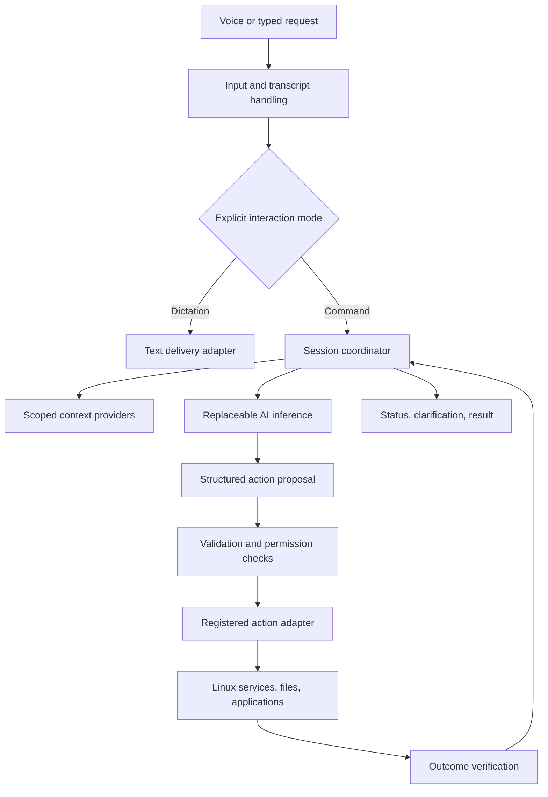

# Architecture: components and their boundaries

Return to the [project map](README.md) for the high-level reading order. This chapter
connects the proposed system to the code and tests that currently exist. It is the
component index; detailed implementation belongs beside that component's code.

## Direction

Prototype a user-session system layered on an existing Linux desktop, then package the proven components into an OS image. This avoids making kernel or compositor changes a prerequisite for learning whether the voice-to-action experience works. It does not settle the final distribution or desktop.

Start with logical boundaries; do not create a separate process for every box merely because it appears here. Inference and any privileged action helper have stronger reasons for process isolation than ordinary internal modules.

This is one candidate OS harness arrangement. A cohesive application or cooperating desktop services could implement the same responsibilities.

## Implemented prototype map

The table follows the request flow above, then lists the evaluation tools used
to check it. These are Python experiments running in a user process. They do not
yet form an installed Linux service, a microphone pipeline, or a production OS.
The console owns coordinator changes; the inference worker receives copied data
and returns proposals. All implemented action effects stay in disposable files.

| Component and responsibility | Input → output | Failure and authority boundary | Code and focused tests |
| --- | --- | --- | --- |
| **Transcript gate:** keep partial speech separate from finalized requests; preserve activation mode and correction ordering | Synthetic partial/final/error events → preview or finalized command/dictation | Gaps and conflicting events fail; stale captures are ignored. Starting a correction invalidates old planning. Recognition cannot choose permissions or change the activated mode. No audio is captured. | [Gate](../../experiments/session_coordinator/transcripts.py), [tests](../../experiments/session_coordinator/test_transcripts.py) |
| **Session coordinator:** own request identity, revisions, bounded correction context, state, cancellation, and optional confirmation | Final text, policy changes, correlated outcomes → request state and admitted proposal | Rejects obsolete jobs and invalid proposals; binds confirmation to the exact proposal. Cancellation stops later work and preserves known effects. This is a trusted in-process API, not an authenticated service. | [Coordinator](../../experiments/session_coordinator/coordinator.py), [lifecycle tests](../../experiments/session_coordinator/test_coordinator.py), [correction-context tests](../../experiments/session_coordinator/test_correction_context.py) |
| **Inference worker:** keep interpretation off the console thread with finite capacity | Copied job → correlated outcome, error, or cancellation record | Capacity includes undrained results. Cancellation suppresses delivery; it cannot forcibly stop a running interpreter. Worker results never dispatch actions. | [Worker](../../experiments/session_coordinator/worker.py), [tests](../../experiments/session_coordinator/test_worker.py) |
| **Inference adapter:** translate a configured model protocol into a bounded structured outcome | Mode, utterance, and scoped context → proposal, clarification, or unsupported result | Rejects malformed/truncated output; does not retry or follow redirects. Model output cannot supply grants or approvals. Numeric loopback confines the client connection, not the server's own behavior. | [Adapter](../../experiments/session_coordinator/inference.py), [fake-server tests](../../experiments/session_coordinator/test_inference.py) |
| **Admission checker:** independently validate actions against current session and grants | Session, proposal, grants → allow/deny and reason | Rejects unknown fields, stale revisions, invalid arguments, and missing capabilities. An admitted proposal is data, not evidence that an action occurred. | [Checker](../../experiments/contract_reference/check_contracts.py), [unit tests](../../experiments/contract_reference/test_contracts.py), [fixtures](../../experiments/contract_reference/fixtures.json) |
| **Action executor and journal:** perform and record the two implemented operations | Admitted create-folder/search plan → per-step results and recovery evidence | Rechecks cancellation and grants before steps; contains effects in a generated workspace. Interrupted writes can remain uncertain. Journal replay does not establish exactly-once or power-loss durability. | [Executor and journal](../../experiments/sandbox_workflow/demo.py), [effect/recovery tests](../../experiments/sandbox_workflow/test_workflow.py) |
| **Console and command-line entry:** expose sequential-key controls and show outcomes | Typed lines and worker results → coordinator calls and displayed state | Owner thread alone admits and dispatches. Dictation returns panel text; no application insertion or media playback exists. Actions remain synchronous even when inference is asynchronous. | [Console](../../experiments/session_coordinator/console.py), [entry point](../../experiments/session_coordinator/cli.py), [console tests](../../experiments/session_coordinator/test_console.py), [CLI tests](../../experiments/session_coordinator/test_cli.py) |
| **Intent evaluator:** record model-run evidence and compare structured outcomes | Public development cases and explicit predictions/server → preserved run files and scores | Reference answers stay out of model input; errors cannot become successful unsupported answers. It never constructs an action executor. Synthetic tests do not measure a model. | [Runner](../../experiments/intent_evaluation/run_inference.py), [scorer](../../experiments/intent_evaluation/score.py), [runner tests](../../experiments/intent_evaluation/test_run_inference.py), [scorer tests](../../experiments/intent_evaluation/test_score.py) |

Correction context retains at most four prior finalized turns, bounded to 16 KiB
of ASCII-escaped JSON. It holds user text and sanitized interpretations, never
host authority. Starting a correction invalidates the old plan before replacement
input is final; interpretation replans under current permissions. Policy changes
strip historical interpretations, and terminal requests clear this pending
context. This supports clarification and correction plumbing; no real model's
understanding has been measured.

The test links identify each component's behavioral checks; fake HTTP, console
subprocesses, and filesystem recovery are integration checks in addition to unit
tests. [QA boundary regressions](../../experiments/session_coordinator/test_boundary_regressions.py)
also exercise failures across component boundaries.
[/home/mike/git/voicePlusLinux/developer-guide-check-commands.md](../../developer-guide-check-commands.md) is the single place for repository
check commands. Test counts and execution results belong in [progress](progress.md).

### Gaps between this prototype and the proposed system

- **Voice and desktop:** connect an admitted recognizer, measure against V2T,
  implement target-safe dictation delivery, and validate controls with Mike.
- **AI:** verify an exact open-source model/server combination and measure English
  interpretation. The default three-phrase interpreter is deterministic plumbing.
- **Execution and recovery:** replace disposable roots and the experimental journal
  with reviewed production implementations. File moves remain unimplemented.
- **Isolation and integration:** add process supervision, authenticated service
  boundaries where needed, real Linux session integration, packaging, and recovery.
- **Shared contracts:** the coordinator currently imports outcome validation from
  the intent scorer. That is prototype reuse; a production contract module must be
  owned independently of evaluation tooling and retain its own focused tests.

Production language, Linux base, model, and transport choices remain open. A
component is not complete merely because its prototype tests pass; its remaining
integration and evidence gaps must also be closed.

## Proposed system responsibilities and authority

| Component | Owns | Does not decide |
| --- | --- | --- |
| Input | Activation, audio capture, typed input, transcript versions | Whether an OS action is permitted |
| Session coordinator | Request lifecycle, cancellation, current mode, context references | Truth of an action outcome without evidence |
| Inference adapter | Model-specific input/output and resource management | Its own capabilities or permissions |
| Context providers | Bounded retrieval from selected sources | Whether retrieved text is a new user instruction |
| Policy/validation | Supported action names, schema checks, permission scope, confirmation rules | The user's intended ambiguous target |
| Action adapters | Typed operations and outcome evidence | Arbitrary model-provided shell execution |
| Desktop interface | Listening/status display, correction, approval, results | Hidden automatic expansion of access |
| Journal | Minimal lifecycle/effect metadata needed for recovery | Permanent storage of every utterance |

## Proposed lifecycle

Each request has a unique ID and a monotonic revision. Input can be partial while speech is being transcribed. Only finalized command input is eligible for action planning in the first prototype. AI-assisted transcription is allowed, but a revised transcript invalidates any proposal derived from the old revision.

Typical command states are `received`, `interpreting`, `needs_clarification`, `proposed`, `awaiting_confirmation`, `executing`, and a terminal result such as `succeeded`, `failed`, `cancelled`, or `outcome_unknown`. Multi-step requests can finish partially; retain per-step results rather than presenting partial completion as success.

Dictation follows a shorter path: `recording` → `transcribing` → `ready_to_insert` → `inserted` or `delivery_failed`. It does not silently enter command mode because the text sounds imperative.

## Reliability principles

- A new inference process can be started after a model crash without restarting the desktop.
- Losing the microphone stops capture and marks the request incomplete; it does not submit a truncated command automatically.
- Losing the desktop session invalidates pending input targets and approvals.
- On coordinator restart, unfinished mutations are reconciled against actual effects before any retry.
- Cancellation stops new steps. It cannot retroactively erase a write already completed.
- The UI may report “submitted” when an adapter lacks verification, but must not report verified success.
- Queues have finite capacity. Busy states and dropped/incomplete audio must be visible.

## Open decisions

Transport between processes, UI toolkit, model host, desktop integration, and persistence format remain open. Prefer language-neutral structured messages so experiments do not dictate all implementation languages. The minimum useful prototype should be capable of running with fake input, fake inference, and sandboxed action adapters before live microphone or desktop integration is added.
