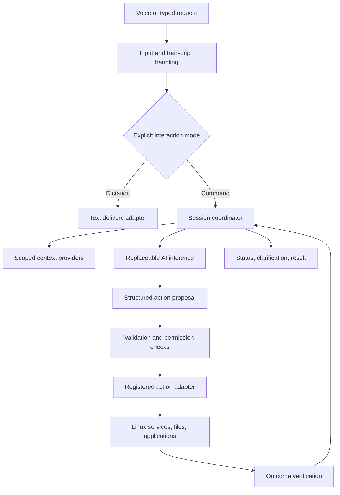

# Proposed architecture

## Direction

Prototype a user-session system layered on an existing Linux desktop, then package the proven components into an OS image. This avoids making kernel or compositor changes a prerequisite for learning whether the voice-to-action experience works. It does not settle the final distribution or desktop.

Start with logical boundaries; do not create a separate process for every box merely because it appears here. Inference and any privileged action helper have stronger reasons for process isolation than ordinary internal modules.

This is one candidate OS harness arrangement. A cohesive application or cooperating desktop services could implement the same responsibilities.

## Responsibilities and authority

| Component | Owns | Does not decide |
| --- | --- | --- |
| Input | Activation, audio capture, typed input, transcript versions | Whether an OS action is permitted |
| Session coordinator | Request lifecycle, cancellation, current mode, context references | Truth of an action outcome without evidence |
| Inference adapter | Model-specific input/output and resource management | Its own capabilities or permissions |
| Context providers | Bounded retrieval from selected sources | Whether retrieved text is a new user instruction |
| Policy/validation | Supported action names, schema checks, permission scope, confirmation rules | The user's intended ambiguous target |
| Action adapters | Typed operations and outcome evidence | Arbitrary model-provided shell execution |
| Desktop interface | Listening/status display, correction, approval, results | Hidden automatic expansion of access |
| Journal | Minimal lifecycle/effect metadata needed for recovery | Permanent storage of every utterance |

## Proposed lifecycle

Each request has a unique ID and a monotonic revision. Input can be partial while speech is being transcribed. Only finalized command input is eligible for action planning in the first prototype. AI-assisted transcription is allowed, but a revised transcript invalidates any proposal derived from the old revision.

Typical command states are `received`, `interpreting`, `needs_clarification`, `proposed`, `awaiting_confirmation`, `executing`, and a terminal result such as `succeeded`, `failed`, `cancelled`, or `outcome_unknown`. Multi-step requests can finish partially; retain per-step results rather than presenting partial completion as success.

Dictation follows a shorter path: `recording` → `transcribing` → `ready_to_insert` → `inserted` or `delivery_failed`. It does not silently enter command mode because the text sounds imperative.

## Reliability principles

- A new inference process can be started after a model crash without restarting the desktop.
- Losing the microphone stops capture and marks the request incomplete; it does not submit a truncated command automatically.
- Losing the desktop session invalidates pending input targets and approvals.
- On coordinator restart, unfinished mutations are reconciled against actual effects before any retry.
- Cancellation stops new steps. It cannot retroactively erase a write already completed.
- The UI may report “submitted” when an adapter lacks verification, but must not report verified success.
- Queues have finite capacity. Busy states and dropped/incomplete audio must be visible.

## Open decisions

Transport between processes, UI toolkit, model host, desktop integration, and persistence format remain open. Prefer language-neutral structured messages so experiments do not dictate all implementation languages. The minimum useful prototype should be capable of running with fake input, fake inference, and sandboxed action adapters before live microphone or desktop integration is added.
